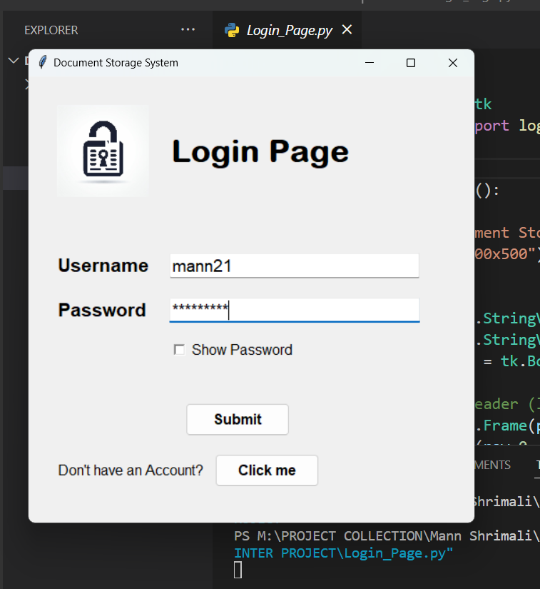
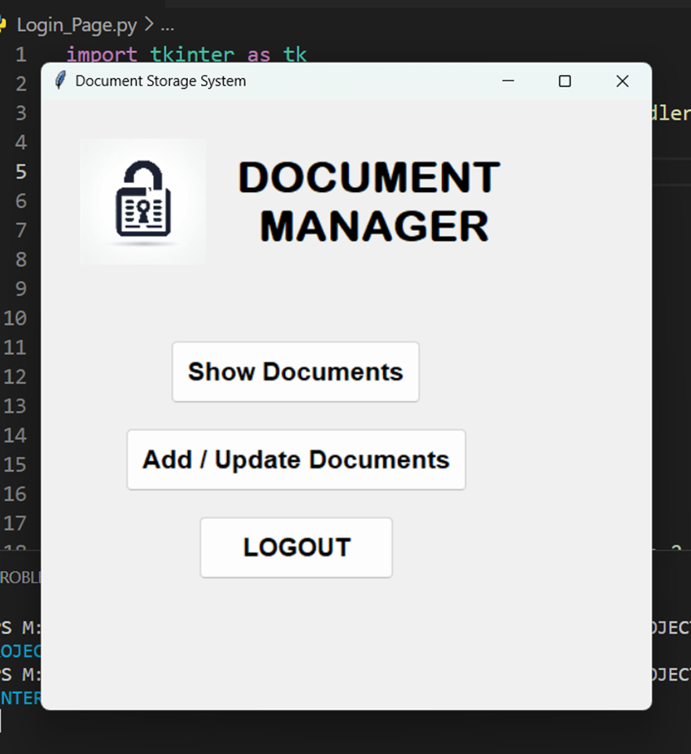

# Document Manager

1. to create a Database and table ,open MYSQL workbench and and run the following command.

```
create database document_manager;

use document_manager;
show tables;
create table documents(username varchar(100) , password varchar (100), AADHAR bigint,PANCARD varchar(10) , PASSPORT varchar(12) ,BANK_AC bigint);
describe documents;

```

2. in the ENV file , make sure you have entered your MYSQL DB name and password.
3. to run the project , run the Login_Page.py file.


## Table of Contents
- [Screenshots](#screenshots)
- [Features](#features)
- [Installation](#installation)

## Screenshots

Include screenshots or images showcasing your project. Use relative paths for images inside your project.








## Features

Describe the key features of your project. You can include bullet points or any other formatting that suits your needs.

## Installation

Provide instructions on how to install your project. You can include code snippets or commands.

```bash
pip install your-package-name
